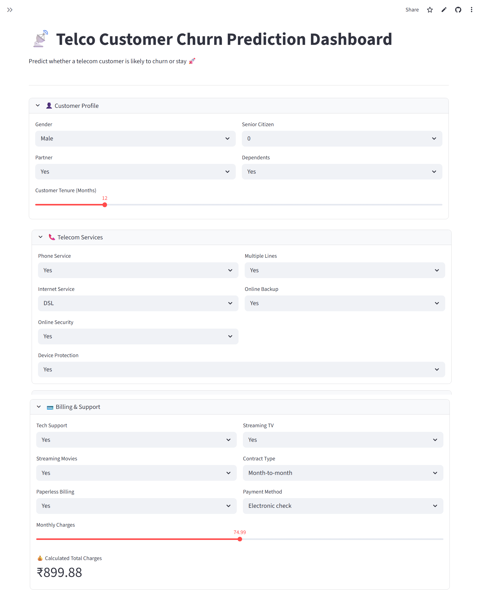
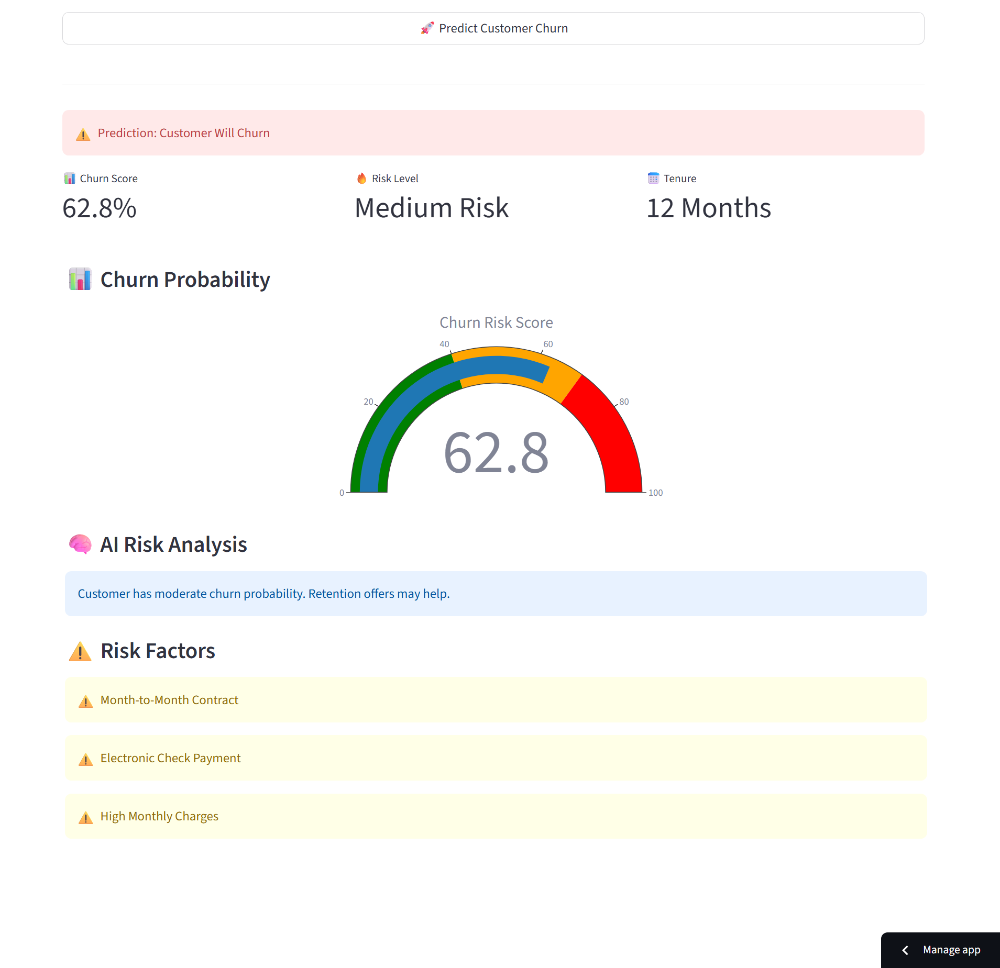
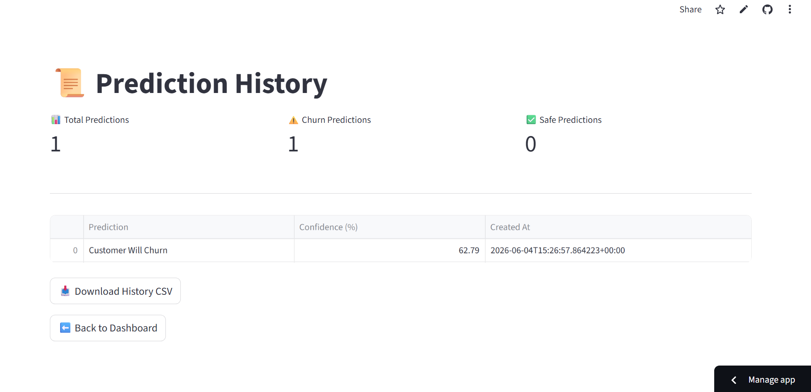

# 📡 Telecom Customer Churn Predictor

An end-to-end Production-Ready Machine Learning application that predicts whether a telecom customer is likely to churn or stay.

---

# 🚀 Live Demo

👉 https://telecom-ai-churn-predictor.streamlit.app/

---

# 📸 Project Screenshots

## 🎨 Dashboard UI



---

## 🤖 Prediction Result



---

## 📜 Prediction History



---

# 🧠 Project Overview

This project combines Machine Learning, FastAPI, Streamlit, and Supabase to deliver a complete customer churn prediction platform.

Users can:

* Create an account
* Log in securely
* Predict customer churn
* View prediction history
* Analyze previous predictions
* Download prediction records as CSV

The system stores user-specific prediction data securely using Row-Level Security (RLS).

---

# ⚙️ System Architecture

```text
Streamlit Frontend
        │
        ▼
FastAPI Backend
        │
        ▼
Machine Learning Model
        │
        ▼
Supabase PostgreSQL Database
        │
        ▼
Prediction History & Analytics
```

---

# 🛠️ Tech Stack

## Machine Learning

* Scikit-learn
* Pandas
* NumPy
* Logistic Regression

## Backend

* FastAPI
* Uvicorn
* Pydantic

## Frontend

* Streamlit

## Database & Authentication

* Supabase Auth
* PostgreSQL
* Row Level Security (RLS)

## Deployment

* Render (Backend API)
* Streamlit Cloud (Frontend)

## Version Control

* Git
* GitHub

---

# ⚡ Features

## Authentication

* User Signup
* User Login
* Secure Session Management
* Supabase Authentication

## Prediction Engine

* Customer Churn Prediction
* Confidence Score
* Risk Analysis

## Database Features

* Store Prediction History
* User-Specific Records
* PostgreSQL Database
* Row-Level Security (RLS)

## Analytics

* Prediction History Dashboard
* Download Predictions as CSV

---

# 🎯 Model Output

The system predicts:

* ✅ Customer Will Stay
* ⚠️ Customer Will Churn

Along with:

* Confidence Score
* Risk Category

---

# 🔒 Security

This application uses Supabase Row-Level Security (RLS) to ensure:

* Users can only access their own prediction history
* User data remains isolated and secure
* Database access follows least-privilege principles

---

# 📈 Future Improvements

* Docker Containerization
* CI/CD Pipeline
* Explainable AI (SHAP)
* Email Notifications
* Admin Analytics Dashboard
* Monitoring & Logging

---

# 👨‍💻 Author

Shushank Singh

If you found this project useful, consider giving it a ⭐ on GitHub.
