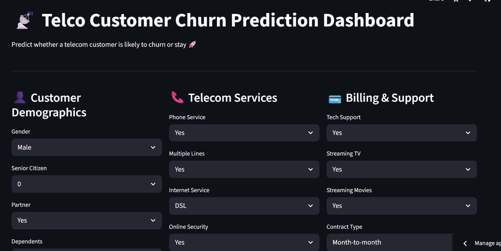
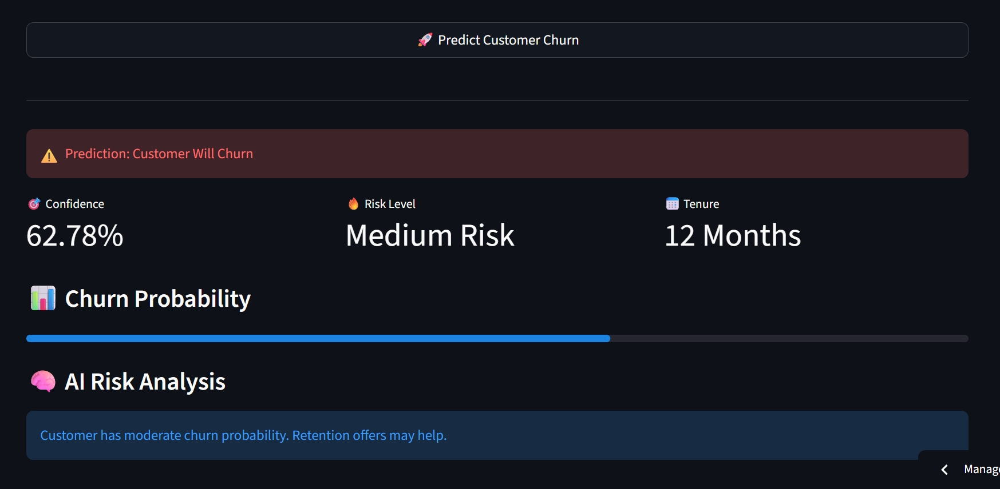

# 📡 Telecom Customer Churn Predictor

An end-to-end Machine Learning project that predicts whether a telecom customer is likely to churn or stay.

## 🚀 Live Demo

👉 https://telecom-ai-churn-predictor.streamlit.app/

---

# 📸 Project Screenshots

## 🎨 Dashboard UI

---

## 🤖 Prediction Result

---

# 🧠 Project Overview

This project uses Machine Learning to analyze telecom customer behavior and predict customer churn probability.

The system includes:

* 🤖 Machine Learning model
* 🚀 FastAPI backend
* 🎨 Streamlit frontend
* 🌍 Cloud deployment
* ✅ Data validation using Pydantic
* 📊 Churn probability + risk analysis

---

# 🛠️ Tech Stack

## Machine Learning

* Scikit-learn
* Pandas
* NumPy
* XGBoost

## Backend

* FastAPI
* Uvicorn
* Pydantic

## Frontend

* Streamlit

## Deployment

* Render (Backend API)
* Streamlit Cloud (Frontend)

## Version Control

* Git
* GitHub

---

# ⚡ Features

* Customer churn prediction
* Churn confidence score
* Risk level analysis
* Interactive Streamlit dashboard
* FastAPI REST API
* Input validation using Pydantic
* Deployment-ready architecture

---

# 🎯 Model Output

The system predicts:

* ✅ Customer Will Stay
* ⚠️ Customer Will Churn

Along with:

* Confidence score
* Risk category

---

# 📈 Future Improvements

* Docker support
* CI/CD pipeline
* User authentication
* Monitoring & logging
* Database integration

---

# 👨‍💻 Author

Shushank Singh

If you liked this project, feel free to ⭐ the repository.
